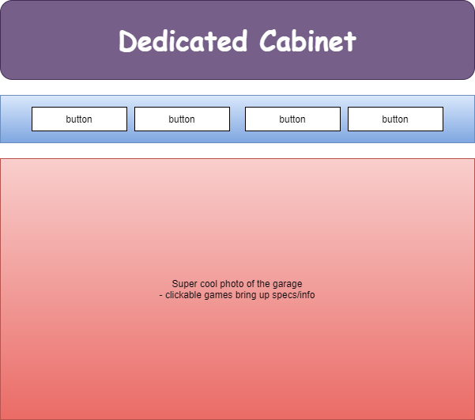

# Dedicated Cabinet

#### Displaying the world's greatest arcade games in the only way they deserve:  Their own dedicated game cabinets.

#### By _**Scott Hutley**_

## Technologies Used

* JavaScript
* React
* HTML
* CSS
* NPM

## Description

The original intent of this app was to display my friend's personal collection of 80s and 90s arcade games. It has the potential to expand it's use for anyone who wishes to currate and/or display their personal arcades. 

## Setup and Installation

* Clone https://github.com/Singleballtheory/dedicated-cabinet to your computer
* Navigate to the Dedicated-Cabinet directory in your terminal
* At the $ prompt, enter "npm install"
* Enter "npm run build" and then "npm run start" to launch app in browser

## Known Bugs/Missing Features

* No click functions to view game details
* Full CRUD and authentication not implimented to allow for person curration
* Missing numerous styling aspects

## License

[MIT](https://opensource.org/licenses/MIT)

_Copyright (c) 2021 Scott Hutley_

## Contact Information

_Scott Hutley <scotthutley1@comcast.net>_